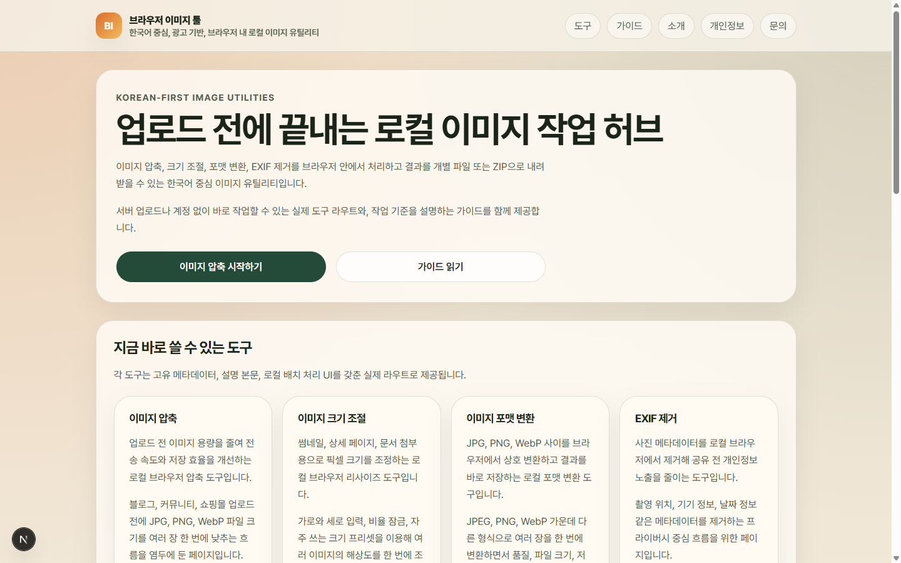
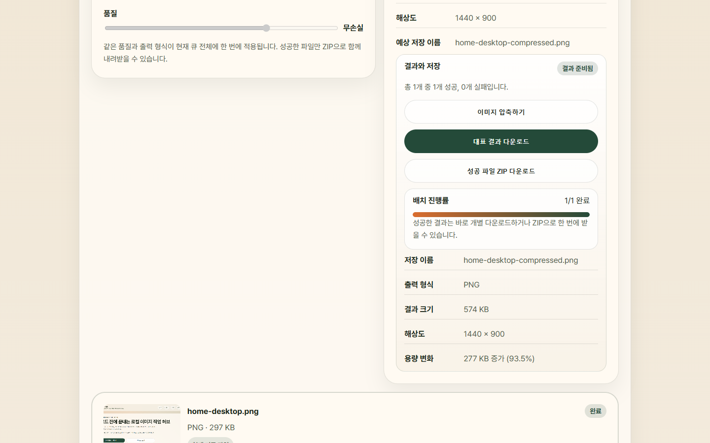

# 브라우저 이미지 툴

브라우저 안에서 이미지 압축, 크기 조절, 포맷 변환, EXIF 정리를 끝내는 한국어 중심 이미지 유틸리티 사이트입니다. 이 저장소는 실제 제품 형태를 염두에 둔 프론트엔드 포트폴리오 프로젝트이며, 파일 처리와 배치 내보내기를 모두 브라우저에서 해결하는 흐름을 구현합니다.

## 어떤 제품인가

- 커뮤니티, 블로그, 쇼핑몰, 문서 첨부 전에 이미지를 빠르게 정리하고 싶은 사용자를 위한 도구입니다.
- 복잡한 편집기보다 업로드 전 준비 작업에 집중합니다.
- 각 도구는 실제 URL, 개별 메타데이터, 설명형 HTML 본문, 클라이언트 도구 셸을 함께 가집니다.

## 현재 구현된 기능

- 이미지 압축: JPEG, PNG, WebP를 다시 인코딩해 용량을 줄이고 결과를 비교합니다.
- 이미지 크기 조절: 가로·세로 입력, 비율 유지, 프리셋으로 여러 장의 해상도를 맞춥니다.
- 이미지 포맷 변환: JPEG, PNG, WebP 사이를 상호 변환합니다.
- EXIF 제거: 원본 형식으로 다시 저장해 메타데이터를 정리합니다.
- 배치 내보내기: 성공한 결과만 골라 개별 저장하거나 ZIP으로 내려받습니다.
- 가이드 콘텐츠: 압축 기준, 포맷 선택, 프라이버시, 배치 리사이즈 판단 기준을 설명합니다.

## 왜 브라우저 로컬 처리가 중요한가

- 업로드한 이미지가 서버로 전송되지 않아 민감한 파일을 다룰 때 부담이 적습니다.
- 로그인, 파일 보관, 클라우드 저장 없이 바로 작업하고 끝낼 수 있습니다.
- 처리 결과를 확인한 뒤 필요한 파일만 직접 저장하므로 흐름이 단순합니다.
- 무료 광고 기반 운영을 검토하더라도 파일 내용 처리 자체는 브라우저 안에 남기는 방향을 유지할 수 있습니다.

## 기술 구성과 접근 방식

- Next.js App Router
- TypeScript
- React 19
- 서버 렌더링된 설명형 페이지 + 클라이언트 전용 도구 셸
- 브라우저 Canvas 기반 이미지 처리
- Web Worker 우선, 메인 스레드 폴백 처리
- 브라우저 메모리 내 배치 ZIP 생성
- Vitest 기반 유틸리티 테스트

도구 페이지는 초기 응답에서 설명 콘텐츠를 먼저 렌더링하고, 실제 파일 처리 UI는 클라이언트에서 이어 붙입니다. 이렇게 하면 각 도구가 검색 가능한 독립 페이지로 동작하면서도, 파일 처리는 끝까지 브라우저 안에 머무를 수 있습니다.

## 스크린샷

### 홈



### 압축 도구



## 로컬 실행

```bash
npm install
npm run dev
```

브라우저에서 [http://localhost:3000](http://localhost:3000)을 열면 됩니다.

### 주요 명령어

- `npm run dev`: 개발 서버 실행
- `npm run lint`: ESLint 실행
- `npm run typecheck`: TypeScript 검사
- `npm run test`: Vitest 실행
- `npm run build`: 프로덕션 빌드
- `npm run start`: 프로덕션 서버 실행

## 현재 한계

- 지원 형식은 JPEG, PNG, WebP에 한정됩니다.
- PDF, HEIC, RAW, 비디오, AI 기능은 포함하지 않습니다.
- 백엔드 업로드, 계정, 작업 이력 저장, 클라우드 동기화는 없습니다.
- 브라우저 메모리를 사용하므로 매우 큰 파일이나 대량 배치는 기기 성능에 영향을 받을 수 있습니다.
- EXIF 제거는 메타데이터 정리에 초점이 있으며, 이미지 안에 직접 보이는 민감 정보는 가리지 않습니다.

## 다음 단계

- 도구별 프리셋과 안내 문구를 더 촘촘하게 다듬기
- 가이드와 도구 사이의 내부 연결을 더 실용적으로 확장하기
- 실제 광고 제공사가 확정되면 개인정보·쿠키 고지를 실데이터 기준으로 추가하기
- 대용량 배치 처리에서 워커 활용과 브라우저 메모리 사용을 더 최적화하기

## 문서

- [제품 범위](./docs/product-scope.md)
- [라우트 맵](./docs/route-map.md)
