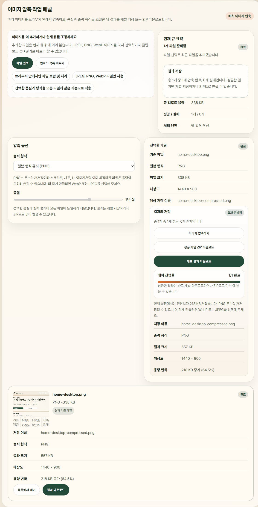
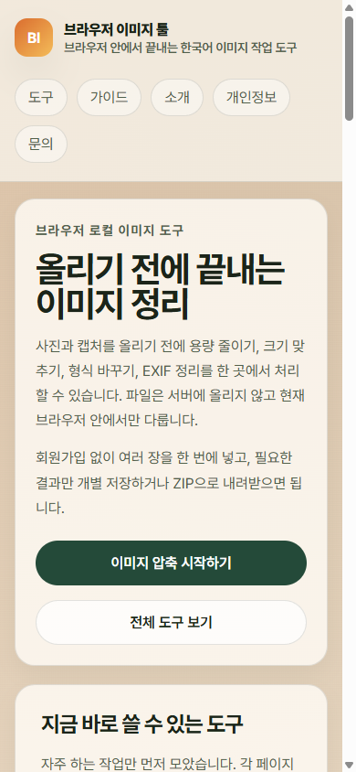

# 브라우저 이미지 툴

[](https://github.com/jongha1230/browser-image-tools/actions/workflows/ci.yml)

브라우저에서 블로그 업로드 전 점검, 썸네일·상품 이미지 준비, EXIF 정리까지 처리하는 로컬 이미지 도구 사이트입니다. 이 저장소는 업로드 직전 반복되는 이미지 정리 작업에 집중한 프론트엔드 프로젝트이며, 파일 처리와 다운로드 준비를 모두 브라우저 안에서 끝내는 흐름을 구현합니다.

## 공개 데모

- Production demo: [https://browser-image-tools.vercel.app](https://browser-image-tools.vercel.app)
- Project contact: [browserimagetools@gmail.com](mailto:browserimagetools@gmail.com)
- Secondary support path: [GitHub Issues](https://github.com/jongha1230/browser-image-tools/issues)
- Proof assets package: [docs/proof-assets.md](./docs/proof-assets.md)
- 캡처 기준일: 2026년 3월 15일, Vercel production alias 기준
- 현재 배포는 Production `vercel.app`를 임시 public canonical host로 사용하는 공개 제출 모드입니다.
- 이후 custom domain을 연결하면 Search Console, Search Advisor, canonical, sitemap 검증을 새 host 기준으로 다시 수행해야 합니다.

## 문의 / 지원

- 프로젝트 관련 일반 문의와 운영 연락은 [browserimagetools@gmail.com](mailto:browserimagetools@gmail.com)으로 받습니다.
- 재현 가능한 버그 보고와 공개 추적은 [GitHub Issues](https://github.com/jongha1230/browser-image-tools/issues)를 보조 경로로 유지합니다.
- 민감한 원본 파일은 바로 보내기보다 브라우저/OS 버전, 사용한 도구 URL, 재현 단계, 오류 메시지, 스크린샷을 먼저 정리하는 편을 권장합니다.
- 실제 파일 처리는 계속 브라우저 안에서만 이뤄지며, 이 저장소는 백엔드 업로드나 메일 폼 전송 기능을 추가하지 않습니다.

## 현재 구현된 기능

- 이미지 압축: JPEG, PNG, WebP를 다시 인코딩해 용량을 줄이거나 결과 변화를 비교합니다.
- 이미지 크기 조절: 가로·세로 입력, 비율 유지, 프리셋으로 블로그 본문·썸네일·상품 이미지 해상도를 맞춥니다.
- 이미지 포맷 변환: JPEG, PNG, WebP 사이를 상호 변환해 업로드 형식과 투명 배경 조건을 정리합니다.
- EXIF 제거: 원본 형식으로 다시 저장해 공개 업로드 전 메타데이터를 정리합니다.
- 배치 내보내기: 성공한 결과만 골라 개별 저장하거나 ZIP으로 내려받습니다.
- 가이드 콘텐츠: 압축 기준, 포맷 선택, 프라이버시, 배치 리사이즈 판단 기준을 설명합니다.

## 스크린샷

아래 이미지는 2026년 3월 15일에 production demo를 Playwright CLI로 다시 캡처했습니다. 데스크톱은 `1440x900`, 모바일은 `390x844` 뷰포트를 사용했습니다.

| 홈 | 압축 워크플로 |
| --- | --- |
|  |  |
| 처리 결과 | 모바일 홈 |
|  |  |

압축 결과 캡처는 PNG 무손실 재저장 예시라 결과 파일이 더 커진 실제 케이스를 그대로 보여 줍니다. 더 좋아 보이는 숫자를 만들기보다, UI가 불리한 결과도 그대로 드러내는지 확인하는 데 초점을 맞췄습니다.

## 왜 브라우저 로컬 처리가 중요한가

- 업로드한 이미지가 서버로 전송되지 않아 민감한 파일을 다룰 때 부담이 적습니다.
- 로그인, 파일 보관, 클라우드 저장 없이 바로 작업하고 끝낼 수 있습니다.
- 처리 결과를 확인한 뒤 필요한 파일만 직접 저장하므로 흐름이 단순합니다.
- 무료 광고 기반 운영을 검토하더라도 파일 내용 처리 자체는 브라우저 안에 남기는 방향을 유지할 수 있습니다.

## 기술 구성과 접근 방식

- Next.js App Router
- TypeScript
- React 19
- 서버 렌더링된 설명형 페이지 + 클라이언트 전용 도구 셸
- 브라우저 Canvas 기반 이미지 처리
- Web Worker 우선, 메인 스레드 폴백 처리
- 브라우저 메모리 내 배치 ZIP 생성
- Vitest 기반 유틸리티 테스트

도구 페이지는 초기 응답에서 설명 콘텐츠를 먼저 렌더링하고, 실제 파일 처리 UI는 클라이언트에서 이어 붙입니다. 각 도구가 검색 가능한 독립 페이지로 동작하면서도, 파일 처리는 끝까지 브라우저 안에 머무를 수 있습니다. 처리 경로 다이어그램과 캡처 근거는 [docs/proof-assets.md](./docs/proof-assets.md)에 정리했습니다.

## 브라우저 지원 / 알려진 제한

- 2026년 3월 16일 기준 공개 수동 확인 범위는 Chromium 계열 브라우저의 현재 라우트 로딩과 기본 처리 흐름입니다.
- 최신 Chrome, Edge 같은 Chromium 계열 데스크톱 브라우저를 우선 권장합니다.
- Safari와 Firefox도 Canvas, Blob, `URL.createObjectURL`, 다운로드 링크, Web Worker 같은 필수 웹 API가 모두 동작하면 사용할 수 있지만, 현재 저장소에서 공개적으로 폭넓게 수동 검증했다고 주장하지는 않습니다.
- Web Worker 초기화가 불가능하거나 `OffscreenCanvas`, `convertToBlob` 같은 관련 API가 빠진 환경에서는 메인 스레드 폴백 경로로 같은 처리 파이프라인을 실행합니다. 이 경우 결과 형식과 저장 흐름은 같지만 탭 반응은 더 느려질 수 있습니다.
- 매우 큰 파일, 긴 배치, 반복 ZIP 내보내기는 브라우저 메모리와 기기 성능에 직접 영향을 받습니다. 모바일보다 데스크톱 브라우저가 안정적인 경우가 많습니다.
- 대표 파일 1장으로 먼저 확인한 뒤 작은 묶음으로 나누면 배치 실패 범위를 줄이기 쉽습니다.
- 지원 형식은 JPEG, PNG, WebP에 한정됩니다.
- 백엔드 업로드, 계정, 데이터베이스, 클라우드 동기화, PDF, HEIC, RAW, 비디오, 엔드유저 AI 기능은 포함하지 않습니다.

자세한 제한 사항은 [docs/known-limitations.md](./docs/known-limitations.md)를 확인하면 됩니다.

## 로컬 실행

```bash
npm install
npm run dev
```

브라우저에서 [http://localhost:3000](http://localhost:3000)을 열면 됩니다.

### 주요 명령어

- `npm run dev`: 개발 서버 실행
- `npm run lint`: ESLint 실행
- `npm run typecheck`: TypeScript 검사
- `npm run test`: Vitest 실행
- `npm run build`: 프로덕션 빌드
- `npm run start`: 프로덕션 서버 실행

## Vercel 배포 메모

- 공개 데모 단계에서는 Vercel Production 배포를 안정적인 공유용 `vercel.app` 주소로 사용합니다.
- 현재 운영 기준은 Production `vercel.app`를 임시 public canonical host로 두고, Production 환경 변수 `SITE_URL`과 `NEXT_PUBLIC_SITE_URL`을 정확한 `https://browser-image-tools.vercel.app` 원본으로 맞추고 `ALLOW_VERCEL_APP_INDEXING=true`를 함께 두는 방식입니다.
- 이 모드에서는 canonical, `robots.txt`, `sitemap.xml`, `rss.xml`, Open Graph URL이 모두 Production `vercel.app` 기준으로 열리고, Preview는 계속 비색인으로 유지해야 합니다.
- demo-first 운영으로 되돌리려면 `SITE_URL`, `NEXT_PUBLIC_SITE_URL`, `ALLOW_VERCEL_APP_INDEXING`를 모두 비워 두고 `noindex`, 전체 차단 `robots.txt`, 빈 `sitemap.xml`, `404` `rss.xml`이 복구되는지 다시 확인합니다.
- 최종 도메인을 연결한 뒤에는 Production 환경 변수 `SITE_URL`과 `NEXT_PUBLIC_SITE_URL`을 같은 `https://` 커스텀 원본으로 바꾸고, `ALLOW_VERCEL_APP_INDEXING`는 비우거나 `false`로 돌리는 편이 명확합니다.
- 자세한 운영 절차는 [docs/vercel-launch.md](./docs/vercel-launch.md)를 확인하면 됩니다.

## 문서

- [Proof assets package](./docs/proof-assets.md)
- [브라우저 지원 / known limitations](./docs/known-limitations.md)
- [제품 범위](./docs/product-scope.md)
- [라우트 맵](./docs/route-map.md)
- [Vercel launch guide](./docs/vercel-launch.md)
