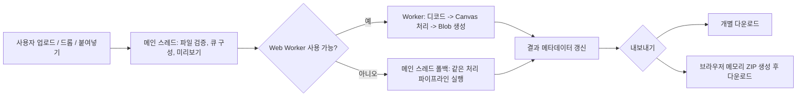

# Proof Assets Package

README, 포트폴리오 케이스 스터디, PR 설명에서 재사용할 수 있는 공개 증빙 묶음입니다. 기능 목록을 늘리는 대신, 현재 구현 상태를 더 신뢰 가능하게 보여 주는 자료만 모았습니다.

## 공개 데모 기준점

- URL: [https://browser-image-tools.vercel.app](https://browser-image-tools.vercel.app)
- 배포 유형: Vercel production alias
- 캡처 기준일: 2026년 3월 15일
- 현재 상태: 커스텀 도메인 연결 전까지 Production `vercel.app`를 임시 public canonical host로 사용

## 포트폴리오용 핵심 설명

브라우저 이미지 툴은 한국어 중심 정보 구조와 로컬 전용 파일 처리 흐름을 결합한 이미지 유틸리티 프로젝트입니다. 각 도구는 실 URL, 개별 메타데이터, 설명형 SSR 본문을 갖고 있고, 실제 파일 처리와 ZIP 내보내기는 브라우저 안에서만 실행됩니다. 서버 업로드 없이도 제품다운 흐름, 배치 처리, 실패/성공 상태, 다운로드 단계를 한 화면에서 확인할 수 있다는 점이 이 프로젝트의 핵심 증거입니다.

## 에셋 목록

| 에셋 | 경로 | 용도 | 메모 |
| --- | --- | --- | --- |
| 홈 데스크톱 스크린샷 | [docs/screenshots/home-desktop.png](./screenshots/home-desktop.png) | README 첫인상, 포트폴리오 소개 | Production demo 기준 |
| 압축 워크플로 스크린샷 | [docs/screenshots/compress-workflow.png](./screenshots/compress-workflow.png) | 실제 작업 패널 증빙 | 업로드 후 실행 전 상태 |
| 압축 결과 스크린샷 | [docs/screenshots/compress-result.png](./screenshots/compress-result.png) | 결과 저장, 배치 진행률, 수치 증빙 | 성공 상태와 ZIP/개별 다운로드 노출 |
| 모바일 스크린샷 | [docs/screenshots/home-mobile.png](./screenshots/home-mobile.png) | 반응형 소개 자료 | `390x844` 기준 |
| CI 배지 | [README.md](../README.md) | 저장소 검증 신뢰도 | GitHub Actions `ci.yml` 연결 |

## 캡처 문맥

- 캡처는 Playwright CLI 래퍼로 production demo를 직접 열어 다시 수집했습니다.
- 데스크톱 뷰포트는 `1440x900`, 모바일 뷰포트는 `390x844`를 사용했습니다.
- 압축 워크플로와 결과 상태는 커밋된 PNG 스크린샷 파일을 실제 입력으로 사용했습니다.
- 그 결과, PNG 무손실 재저장 예시에서는 출력 파일이 원본보다 `218 KB` 커졌습니다. 이 수치는 숨기지 않았고, UI가 불리한 결과도 그대로 보여 준다는 증거로 유지했습니다.

## 처리 경로 다이어그램

## 브라우저 지원 / 현재 제한

- 수동 검증 범위는 2026년 3월 15일 production demo의 Chromium 캡처 흐름입니다.
- 현재 구현은 Canvas, Blob, Web Worker, 다운로드 링크를 지원하는 최신 브라우저를 전제로 합니다.
- Worker 초기화 실패 시 메인 스레드 폴백이 동작하지만, 대용량 배치에서는 체감 성능 차이가 날 수 있습니다.
- 지원 형식은 JPEG, PNG, WebP에 한정되며, PDF, HEIC, RAW, 비디오, 백엔드 업로드, 계정 기능은 포함하지 않습니다.
- 자세한 범위 밖 항목과 후속 개선 메모는 [docs/known-limitations.md](./known-limitations.md)에 정리했습니다.

## 재사용 포인트

- README에서는 데모 URL, 배지, 스크린샷 갤러리, proof package 링크를 한 번에 보여 줍니다.
- 포트폴리오 케이스 스터디에서는 위 다이어그램과 캡처 문맥, 스크린샷 4종을 그대로 재사용할 수 있습니다.
- PR 설명에서는 검증 섹션에 production demo 캡처 기준일과 CI 실행 결과를 함께 적으면 됩니다.
